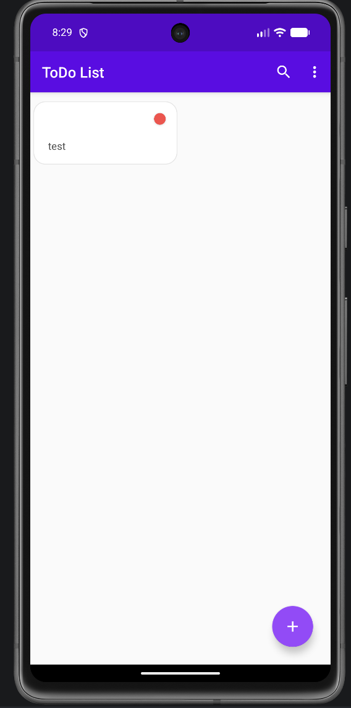

# BUG-1

## Title
Application allows creating a task with an empty title.

## Severity
Medium

## Priority
Medium

## Environment
Android Emulator
Android 14

## Preconditions
Application is running.

## Steps to Reproduce
1. Tap the Add button.
2. Enter a space in the Task Title field.
3. Tap Save.

## Expected Result
The application should display a validation message and prevent task creation.

## Actual Result
The task is created with an empty title.

### Attachments

## Status
Open

# BUG-2

## Title
Application crashes when the device is rotated on the "Add Task" screen.

## Severity
High

## Priority
High

## Environment
- Device: Android Emulator
- OS: Android 14
- Application Version: 1.0

## Preconditions
The application is launched.

## Steps to Reproduce
1. Launch the application.
2. Tap the Add button to open the "Add Task" screen.
3. Rotate the device from Portrait to Landscape.

## Expected Result
The "Add Task" screen remains open and the application continues to work normally.

## Actual Result
The application crashes immediately after rotating the device.

## Frequency
100% (Always)

## Status
Open

# BUG-3

## Title
Task Name and Task Description fields do not accept non-English characters during task creation.

## Severity
Medium

## Priority
Medium

## Environment
- Device: Android Emulator
- OS: Android 14
- Application Version: 1.0

## Preconditions
The application is launched.

## Steps to Reproduce
1. Launch the application.
2. Tap the Add button to open the task creation screen.
3. Try to enter text in the Task Name field using a non-English language (e.g., Belarusian Cyrillic characters).
4. Try to enter text in the Task Description field using the same language.

## Expected Result
The Task Name and Task Description fields accept text input in different languages, including Cyrillic characters.

## Actual Result
The fields do not accept non-English characters. Entered Cyrillic text is not displayed. Only numeric characters can be entered successfully.

## Frequency
100% (Always)

## Status
Open